  

  
  
  

  <a href="https://github.com/KaykeSiquara/KaykeSiquara/blob/main/README.pt-BR.md"><b>Leia em português</b></a>

## About

UI/UX designer and front-end developer, the hybrid often called a UX engineer or a design engineer. I ship what I design: the screen in Figma and the component in React and TypeScript.

I do my best work on dense, data-heavy interfaces, such as financial tables, reconciliation, long forms and dashboards, and on what holds them up: design systems, strict TypeScript and WCAG 2.1 AA accessibility verified by script, not by eye.

I work in English and Portuguese: fluent in English after a year living and studying in New Zealand, and native in Portuguese.

## Instituto INATOS · 2024 – 2026

A nonprofit running eight social programs for families in vulnerable situations. I owned the design and front end of its internal management system and took it from a Streamlit prototype to production, in place of a web of spreadsheets. It was delivered in 2026 and is still in use.

  

- **The success criterion came before the first screen.** The number on screen is the number that goes into the report, and whoever reads it can trace where it came from. Financial reporting is no longer late.
- **A design system from scratch.** An OKLCH palette derived from the four brand colors, one semantic role per hue, light and dark themes, and a seven-state contract for every control.
- **An action hierarchy that holds.** 49 buttons sat at about 2.4:1 contrast, and every action inherited the color of its context. 79 moved to primary, and only the 8 that destroy data stayed as danger.
- **Density without horizontal scrolling.** Five breakpoints, from 360 to 1920 px, built on container queries: tables become cards below 675 px, and the ID column stays pinned on tablet.
- **Accessibility, counted.** An audit of all 15 modules traced 247 findings to root cause. Accessible names on 257 of 257 fields and 80 of 80 icon-only buttons, focus trapped and returned in 56 dialogs, from 0, and `aria-sort` on 37 columns.
- **No server step.** Batch file renaming with the File System Access API, PDF OCR in the browser with review before saving, XLSX export and DOCX parsing.
- **Validated in the field.** All four departments, observed in real use throughout development, with their requests turned into a prioritized backlog shipped in Scrum sprints.

One report shaped the palette. A user could not tell an orange amount from a red one in a 14 px number, though both passed contrast. Measuring the perceptual distance in OKLab found the problem, and opening 36° between the hues fixed it.

  

## Open source

Five repositories, all MIT, with 559 tests between them.

<table>
  <tr>
    <td width="33%" valign="top"> <b><a href="https://github.com/KaykeSiquara/prumo">Prumo</a></b> Design system · 242 tests</td>
    <td width="33%" valign="top"> <b><a href="https://github.com/KaykeSiquara/ritmo">Ritmo</a></b> Productivity app · 170 tests</td>
    <td width="33%" valign="top"> <b><a href="https://github.com/KaykeSiquara/verba">Verba</a></b> Finance dashboard · 81 tests</td>
  </tr>
</table>

**[Prumo](https://github.com/KaykeSiquara/prumo).** A design system measured before it is claimed. OKLCH tokens in the W3C Design Tokens format, generated into CSS, TypeScript and Tailwind CSS v4, and 33 accessible components on Radix UI, every control in all seven states. The build fails when any of the 39 documented pairs drops below WCAG 2.1, or when a color leaves the sRGB gamut. [Documentation](https://kayke-siquara-prumo.vercel.app).

**[Ritmo](https://github.com/KaykeSiquara/ritmo).** A mobile-first productivity app built on Prumo, with its own identity through token overrides alone. Type “Send report tomorrow 2pm #work p1”, or the same in Portuguese, and its own parser reads the date, time, project, priority and recurrence. [Live demo](https://kayke-siquara-ritmo.vercel.app).

**[Verba](https://github.com/KaykeSiquara/verba).** A finance operations dashboard for nonprofits: a dense table of 480 documents with filters kept in the URL, bulk approval and rejection with the reason kept in the history, CSV that opens cleanly in Excel, and a command palette. Zero axe violations. [Live demo](https://kayke-siquara-verba.vercel.app).

**[contrast-gate](https://github.com/KaykeSiquara/contrast-gate).** A dependency-free WCAG 2.1 contrast gate for design tokens that keeps readability, which is contrast, apart from distinguishability, which is distance in OKLab. 37 tests. The failing line below is real: it came from my own portfolio.

  

**[react-keyboard-primitives](https://github.com/KaykeSiquara/react-keyboard-primitives).** A dependency-free headless combobox and dialog for React, where keyboard behavior is the product. The combobox points at options with `aria-activedescendant` instead of moving focus, and the dialog's focus trap is written by hand. 29 tests.

  

## Stack

  

## Decisions I keep making

- **Contrast is a test, not an opinion.** A pair that drops below its minimum fails the build.
- **Readable and distinguishable are different questions.** Contrast answers the first, OKLab distance the second.
- **Color is never the only signal.** A status carries a symbol and a word as well.
- **Focus stays where the user is.** Every dialog traps it and gives it back.
- **Motion is optional.** Every animation on this page stops for people who ask their system for reduced motion.

## Education and certifications

**Systems Analysis and Development** · UNISUAM, Rio de Janeiro · 2024 – 2026

- **Google Developer Program:** Learn Accessibility, Learn Performance
- **freeCodeCamp:** JavaScript, Responsive Web Design, Front-End Development Libraries
- **Udemy:** UX & Design Thinking, Pro Figma | UI Design
- **SCRUMstudy:** Scrum Fundamentals Certified

  If a repository here claims more than it measures, open an issue on it. That is a bug, and I would like to know.

