  

  
  
  

  <a href="https://github.com/KaykeSiquara"><b>Read in English</b></a>

## Sobre

Designer UI/UX e desenvolvedor front-end, o perfil híbrido que muitas vezes se chama UX engineer ou design engineer. Eu entrego o que desenho: a tela no Figma e o componente em React e TypeScript.

Meu melhor trabalho é em interfaces densas e cheias de dados, como tabelas financeiras, conciliação, formulários longos e dashboards, e no que sustenta essas interfaces: design systems, TypeScript estrito e acessibilidade WCAG 2.1 AA verificada por script, não a olho.

Trabalho em inglês e em português: inglês fluente, depois de um ano morando e estudando na Nova Zelândia, e português nativo.

## Instituto INATOS · 2024 – 2026

Uma organização sem fins lucrativos com oito programas sociais para famílias em situação de vulnerabilidade. Fui responsável pelo design e pelo front-end do sistema interno de gestão e levei o sistema de um protótipo em Streamlit até a produção, no lugar de uma teia de planilhas. Ele foi entregue em 2026 e continua em uso.

  

- **O critério de sucesso veio antes da primeira tela.** O número na tela é o número que vai para o relatório, e quem lê consegue rastrear de onde ele veio. O relatório financeiro não atrasa mais.
- **Um design system do zero.** Uma paleta em OKLCH derivada das quatro cores da marca, um papel semântico por matiz, tema claro e escuro, e um contrato de sete estados para cada controle.
- **Uma hierarquia de ações que se sustenta.** 49 botões estavam em cerca de 2,4:1 de contraste, e toda ação herdava a cor do contexto. 79 passaram a primário, e só os 8 que apagam dados ficaram como perigo.
- **Densidade sem rolagem horizontal.** Cinco faixas de tela, de 360 a 1920 px, com container queries: as tabelas viram cartões abaixo de 675 px, e a coluna de ID fica fixa no tablet.
- **Acessibilidade, contada.** Uma auditoria dos 15 módulos rastreou 247 achados até a causa. Nomes acessíveis em 257 de 257 campos e 80 de 80 botões só com ícone, foco preso e devolvido em 56 diálogos, antes 0, e `aria-sort` em 37 colunas.
- **Sem etapa no servidor.** Renomeação de arquivos em lote com a File System Access API, OCR de PDF no navegador com revisão antes de salvar, exportação em XLSX e leitura de DOCX.
- **Validado em campo.** Os quatro departamentos, observados no uso real durante todo o desenvolvimento, com os pedidos transformados num backlog priorizado e entregue em sprints de Scrum.

Um relato mudou a paleta. Uma usuária não conseguia distinguir um valor laranja de um vermelho num número de 14 px, embora os dois passassem no contraste. Medir a distância perceptual em OKLab encontrou o problema, e abrir 36° entre as matizes resolveu.

  

## Código aberto

Cinco repositórios, todos MIT, com 559 testes entre eles.

<table>
  <tr>
    <td width="33%" valign="top"> <b><a href="https://github.com/KaykeSiquara/prumo">Prumo</a></b> Design system · 242 testes</td>
    <td width="33%" valign="top"> <b><a href="https://github.com/KaykeSiquara/ritmo">Ritmo</a></b> App de produtividade · 170 testes</td>
    <td width="33%" valign="top"> <b><a href="https://github.com/KaykeSiquara/verba">Verba</a></b> Painel financeiro · 81 testes</td>
  </tr>
</table>

**[Prumo](https://github.com/KaykeSiquara/prumo).** Um design system medido antes de afirmado. Tokens em OKLCH no formato W3C Design Tokens, gerados para CSS, TypeScript e Tailwind CSS v4, e 33 componentes acessíveis sobre o Radix UI, com todo controle nos sete estados. O build falha quando qualquer um dos 39 pares documentados fica abaixo da WCAG 2.1 ou quando uma cor sai do gamut sRGB. [Documentação](https://kayke-siquara-prumo.vercel.app).

**[Ritmo](https://github.com/KaykeSiquara/ritmo).** Um app de produtividade pensado primeiro para o celular, feito sobre o Prumo, com identidade própria só por sobrescrita de tokens. Escreva “Enviar relatório amanhã 14h #trabalho !alta”, ou o mesmo em inglês, e o parser próprio entende a data, a hora, o projeto, a prioridade e a repetição. [Demo](https://kayke-siquara-ritmo.vercel.app).

**[Verba](https://github.com/KaykeSiquara/verba).** Um painel de operações financeiras para organizações sem fins lucrativos: uma tabela densa de 480 documentos com filtros guardados na URL, aprovação e recusa em lote com o motivo guardado no histórico, CSV que abre certinho no Excel e uma paleta de comandos. Zero violações do axe. [Demo](https://kayke-siquara-verba.vercel.app).

**[contrast-gate](https://github.com/KaykeSiquara/contrast-gate).** Uma trava de contraste WCAG 2.1 para design tokens, sem dependências, que separa legibilidade, que é contraste, de distinção, que é distância em OKLab. 37 testes. A linha que falha abaixo é real: veio do meu próprio portfólio.

  

**[react-keyboard-primitives](https://github.com/KaykeSiquara/react-keyboard-primitives).** Um combobox e um diálogo headless para React, sem dependências, em que o comportamento de teclado é o produto. O combobox aponta as opções com `aria-activedescendant` em vez de mover o foco, e o focus trap do diálogo é escrito à mão. 29 testes.

  

## Ferramentas

  

## Decisões que eu sempre tomo

- **Contraste é teste, não opinião.** Um par que fica abaixo do mínimo derruba o build.
- **Legibilidade e distinção são perguntas diferentes.** Contraste responde a primeira, distância em OKLab a segunda.
- **Cor nunca é o único sinal.** Um status também leva um símbolo e uma palavra.
- **O foco fica onde a pessoa está.** Todo diálogo prende o foco e devolve.
- **Movimento é opcional.** Toda animação desta página para para quem pede movimento reduzido no sistema.

## Formação e certificações

**Análise e Desenvolvimento de Sistemas** · UNISUAM, Rio de Janeiro · 2024 – 2026

- **Google Developer Program:** Learn Accessibility, Learn Performance
- **freeCodeCamp:** JavaScript, Responsive Web Design, Front-End Development Libraries
- **Udemy:** UX & Design Thinking, Pro Figma | UI Design
- **SCRUMstudy:** Scrum Fundamentals Certified

  Se algum repositório aqui afirma mais do que mede, abra uma issue nele. Isso é um bug, e eu quero saber.

